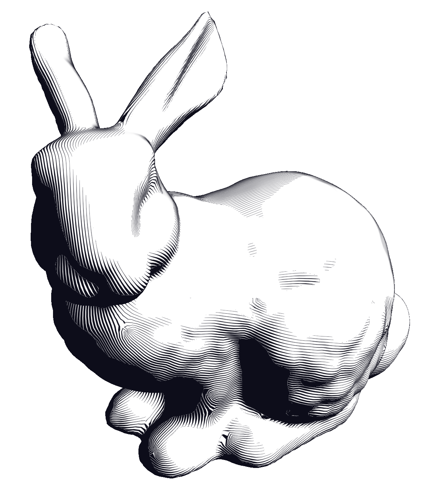

# Hatching

NPR hatching renderer based on globally optimal direction fields and stripe patterns on triangle meshes. Implements the full pipeline from two papers by Knoeppel, Crane, Pinkall, and Schroeder (SIGGRAPH 2013 & 2015), producing pen-and-ink style illustrations where stripe width encodes shading.

  



## Features

- **Globally optimal direction fields** (Knoeppel et al. 2013) — smooth curvature-aligned 2-direction fields via sparse eigenvalue problem with Cholesky factorization
- **Stripe patterns** (Knoeppel et al. 2015) — globally continuous texture coordinates on the implicit double cover, singularity handling via lArg interpolant
- **NPR hatching shader** — stripe width modulated by diffuse shading, silhouette and contour edges, antialiased rendering
- **Interactive controls** — dark/bright threshold, shading amount, stripe frequency, line frequency, perpendicular field toggle
- **Web version** — Emscripten/WebAssembly build with WebGL2, drag-and-drop OBJ loading, no server required

## Building

### Desktop (macOS / Linux)

Requires CMake 3.20+ and a C++20 compiler. All dependencies (Eigen, GLFW, glad, Dear ImGui, tinyobjloader, GoogleTest) are fetched automatically.

```bash
cmake -S . -B build -DCMAKE_BUILD_TYPE=Release
cmake --build build
```

### Web (Emscripten)

Requires the [Emscripten SDK](https://emscripten.org/docs/getting_started/downloads.html).

```bash
cd web
mkdir build && cd build
emcmake cmake ..
emmake make -j8
```

Serve `web/build/` with any HTTP server (e.g. `python3 -m http.server 8080`) and open in a browser.

## Running

```bash
./build/hatching                 # Loads bunny.obj from current directory
./build/hatching mesh.obj        # Load a specific OBJ file
```

### Controls

| Input | Action |
|-------|--------|
| Left drag | Rotate camera |
| Right drag | Pan camera |
| Scroll | Zoom |
| Arrow keys | Rotate light direction |

## Tests

```bash
cmake --build build --target hatching_tests
ctest --test-dir build -R "^(Mesh\|Direction\|Stripe\|Geometry)"
```

42 tests covering mesh topology, discrete differential geometry operators, direction field computation, and the full stripe pattern pipeline.

## Documentation

```bash
doxygen Doxyfile
open docs/doxygen/html/index.html
```

## Project Structure

```
src/
  triangle_mesh.h/cpp    Mesh data structure with edge list and adjacency
  geometry.h/cpp         Angle rescaling, parallel transport, holonomy,
                         cotangent weights, Hopf differential
  direction_field.h/cpp  Energy/mass matrices, eigenvalue solve,
                         curvature alignment, singularity indices
  stripe_pattern.h/cpp   Edge data, stripe energy, inverse power iteration,
                         texture coordinate extraction (Algorithms 3-7)
  renderer.h/cpp         OpenGL hatching renderer
  camera.h/cpp           Orbit camera
  main.cpp               Desktop application entry point
shaders/
  hatching.vert/frag     NPR hatching shader with lArg interpolant
web/
  src/bridge.cpp         Emscripten bindings for hatching_core
  js/                    WebGL2 renderer, orbit camera, application logic
  index.html             Browser UI with drag-and-drop and sliders
tests/
  test_*.cpp             42 unit tests
```

## References

- F. Knoeppel, K. Crane, U. Pinkall, P. Schroeder. *Globally Optimal Direction Fields.* ACM Trans. Graph. 32(4), 2013.
- F. Knoeppel, K. Crane, U. Pinkall, P. Schroeder. *Stripe Patterns on Surfaces.* ACM Trans. Graph. 34(4), 2015.

## License

Free for personal, academic, and research use. No warranty. Commercial use requires written permission from the author.
